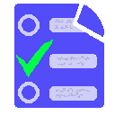

> -----------------------------------------------------------------------------------------------------
>   'Testron' (API JS) - Javascript app for questions of 'test' type.  
>   Author: Juan José Guerra Haba - <dinertron@gmail.com> - 2016 May  
>   License: Free BSD. & Open GPL v.3. Keep credit, please.  
>   Versión: 1.0.0 BETA   
>   File: testron.js               Main Class: testron.Test.js  
>   
> ----------------------------------------------------------------------------------------------------

# TESTRON
[](http://guerratron.github.io/Testron "Testron page")
It is a **Javascript API** to perform questions of *test* type.
[](testron-en/img/testronUI.png "Testron UI")

## DESCRIPTION
This can be used as a preparatory method for academic exams. You only need the question file with a valid structure. This file can be JSON format (object or string) or Javascript Object with one declared variable.  
This rigid structure may contain configuration parameters (the **conf** property) where specify eg the UI containers in which are embed questions and the Marker with information and buttons, or if allowed to select multiple answers or only one, the charset to use, etc.  

> This *namespace* relies heavily on the utility functions of an internal object implemented in the same file, the **'util'** object, which contains methods and objects statics, they could be used outside the same it, using its *'classpath'*.  
> It also contains the class **Test**, **Test.Marker**, **Test.Question** and **Tests.Question.Answer**, but is more comfortable to use one unique method (**parseTestrons**), which will does all job automaticly:  
> ````javascript  
>  
>  var tests = testron.parseTestrons (test, conf);  
>  
>````
>  
> Here *test* represent a *questions-battery*

## FEATURES 
  1. Fully *OOP*
  2. Customizable by **CSS**
  3. Cross-browser
  4. MVC Philosophy
  5. *HTML5* and *CSS3*.  
  6. Reduction to **minimum code** to use by the user.

## USAGE
The **testron** library can be used in several ways:

  1. By a pure **Javascript object** which respects the necessary structure for the *question-test* (see **STRUCTURE TEST**).
  2. Through a **JSON object**
  3. With a pure **string** with JSON format.
  4. Or by the classical form: With its **constructor**. (less advisable)
    
Eg:  

````javascript    

  var tests1 = new testron.Test(objTestJSON, 
                                {container: "containerUI", 
                                markerContainer: "containerMarker"});
  
```` 
Or:  (PREFERABLY)
````javascript  
  
  var tests = testron.parseTestron(objTestronJSON, 
                                  {container: "containerUI", 
                                  markerContainer: "containerMarker"});
  
```` 

then **events** can be used to perform actions conditioned by their **listeners**:
````javascript    

  testron.onClick(function(answer, marker){
      alert("CLICK: " + answer.parent.num + 
            "[" + answer.name + "] ). " + marker.score);
      contMarker.style.visibility = "hidden";
  });
  testron.onFinished(function(test){
      alert("FINISHED TEST: " + test.id);
      contMarker.style.visibility = "visible";
  });
  
```` 

> Of course you must be loaded before the **script** in the HTML header. (*header* secction)  
> ````HTML
>
>  <script type="text/javascript" src="testron.js"></script>
>  
>````

## Public API
 - Constructor
````javascript
  testron.Test (test-questions object);
````
 - Getters 
````javascript
  getTests ();
  addTest (test-questions object);
  removeTest (test-questions object);
  resetTests ();
````
 - OTHERS METHODS
````javascript
  parseTestrons (tests-questions object);
  toJSON ();
````
 - INNER OBJECTS
   - util
````javascript
  toPrecision (floatNumber, precision);
  toDecimals (floatNumber, precision);
  toDigits (num, digits, sign);
  icos [icons object]
  addEvent (elem, eventType, handler);
  ... some listeners ...
````
 - EVENTS
````javascript
  onOk (function listenerOk (answer, marker) { ... });
  onFail (function listenerFail (answer, marker) { ... });
  onClick (function listenerClick (answer, marker) { ... });
  onNext (function listenerNext (question, marker) { ... });
  onMarker (function listenerUpdateMarker (marker) { ... });
  onFinished (function listenerFinished (tests) { ... });
````

## STRUCTURE <small>for the 'question-test' object</small>
This structure is rigid and must be as follows eg:
````javascript
{
    testron: [
        {
            conf: {className: "test-80", container: "container1", 
                   markerContainer: "container2", stopOnSuccess: true, 
                   digits: 2, precision: 2},
            questions: [
                {
                    conf: {num: 1, solution: 2, txt: "Question 1 ???"},
                    answers: [
                        {name: "A", txt: "Answer A"},
                        {name: "B", txt: "Answer B"},
                        {name: "C", txt: "Answer C"}
                    ]
                },
                {
                    conf: {num: 2, solution: 3, txt: "Question 2 ???"},
                    answers: [
                        {name: "A", txt: "Answer A"},
                        {name: "B", txt: "Answer B"},
                        {name: "C", txt: "Answer C"}
                    ]
                },
                {
                    conf: {num: 3, solution: 3, txt: "Question 3 ???"},
                    answers: [
                        {name: "A", txt: "Answer A"},
                        {name: "B", txt: "Answer B"},
                        {name: "C", txt: "Answer C"}
                    ]
                },
                {
                    conf: {num: 4, solution: 1, txt: "Question 4 ???"},
                    answers: [
                        {name: "A", txt: "Answer A"},
                        {name: "B", txt: "Answer B"},
                        {name: "C", txt: "Answer C"}
                    ]
                } // END QUESTION
            ] // END QUESTIONS
        } // END TEST
        //, ... OTHERs TESTS
    ] // END TESTS
}
````

## CONFIGURATION
This options for configuration may be included in **conf** property, these are:
  
  - **className**       : {string} if you wish a specific class name for container 
  - **container**       : {string} the id *DOM* element which embed the UI
  - **markerContainer** : {string} equal for **Marker** (It advised in *fixed* position)
  - **remove**          : {boolean} cleans the *container* before insert the content
  - **markerRemove**    : {boolean} equal for **Marker** container
  - **stopOnSuccess**   : {boolean} allows to select multiple answers until find the correct
  - **digits**          : {number} digits to show in *Marker*
  - **precision**       : {number} accuracy of results

### Authoring
Created and developed entirely by Juan Jose Guerra Haba. &lt;dinertron@gmail.com&gt;
    
Copyright 2016 &copy; [GuerraTron](&#x6d;&#97;&#105;&#108;&#116;&#x6f;&#x3a;&#100;&#105;&#110;&#x65;&#x72;&#x74;&#114;&#x6f;&#110;&#64;&#x67;&#109;&#x61;&#x69;&#x6c;&#46;&#99;&#x6f;&#x6d; "author") 
License GPL v3

### Developing &amp; Tools
Created with [Nodeclipse](https://github.com/Nodeclipse/nodeclipse-1)
 ([Eclipse Marketplace](http://marketplace.eclipse.org/content/nodeclipse), [site](http://www.nodeclipse.org))   
Nodeclipse is free open-source project that grows with your contributions.  
Debug by Firefox + Firebug
Additional editing and cleaning with Notepad++

> I hope It can be useful to someone as it has been for me. In this case it would be appreciated email commenting use or suggestions for future improvements.  
> ¡ PLEASE, KEEP CREDITS AND LINKS, THANKS !

    ... and as George Lucas would say: may the force be with you!